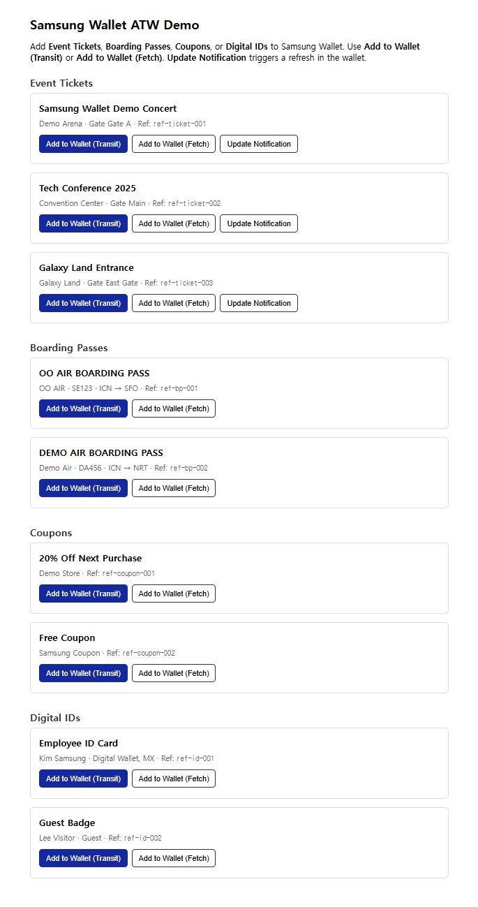

# Samsung Wallet ATW Integration

Open-source reference implementation for integrating **Add to Samsung Wallet (ATW)** with partner backends and clients. Enables partners who manage tickets (or other pass types) to issue them into Samsung Wallet from web and Android with minimal crypto and API boilerplate.

## Goals

- **Framework-agnostic core**: JWS/JWE and auth token logic in pure Java (no Spring) so partners can copy the module into legacy Java 8/11 projects.
- **Ready-to-run demo**: Spring Boot 3.x + H2 + Thymeleaf demo showing Data Transmit, Data Fetch, and Update Notification flows for **Event Ticket**, **Boarding Pass**, **Coupon**, and **Digital ID** card types.
- **Multi-client path**: Structure and docs to add Android (Phase 2) and React/Next.js (Phase 3) demos later.

## Repository Structure

```
samsung-wallet-atw-integration/
├── README.md                    # This file
├── core-crypto/                 # [Phase 1] Pure Java JWS/JWE & auth (no framework)
│   └── KeyStoreLoader, WalletCryptoConfig, WalletCryptoUtil, AuthTokenValidator
├── demo-spring-boot-backend/    # [Phase 1] Spring Boot API + Thymeleaf web demo
│   ├── entity/                  # Ticket, BoardingPass, Coupon, IdCard
│   ├── repository/, service/    # CRUD, CDataService, CardPayloadBuilder
│   ├── api/                     # WalletDemoController (transit-data, fetch-data, update-notification)
│   ├── partner/                 # PartnerWebhookController (Get Card Data, Send Card State)
│   └── resources/data.sql      # Sample data (Samsung spec fields)
├── demo-android-native/         # [Phase 2] Android (Kotlin) demo (placeholder)
└── demo-react-frontend/         # [Phase 3] React/Next.js demo (placeholder)
```

## Prerequisites

- **Partner onboarding**: You must have completed Samsung Wallet Partner onboarding and have:
  - `partnerId`, `cardId`
  - Certificate (and certificate ID) registered with Samsung
  - Private key for signing; Samsung’s public key/certificate for encryption and (for inbound calls) verification
- **Runtime**: Java 17+ for the demo; the core-crypto module can be used with Java 8+ if dependencies are adjusted.

## Quick Start (Phase 1)

1. **Build and run the demo backend** (from repository root):

   **Maven Wrapper (recommended; no Maven install required):**
   ```bash
   # Windows (PowerShell / cmd)
   .\mvnw.cmd -f demo-spring-boot-backend/pom.xml spring-boot:run

   # If port 48080 is in use
   .\mvnw.cmd -f demo-spring-boot-backend/pom.xml spring-boot:run "-Dspring-boot.run.arguments=--server.port=48081"

   # Use partner-test profile (real keys/certificates)
   .\mvnw.cmd -f demo-spring-boot-backend/pom.xml spring-boot:run "-Dspring-boot.run.profiles=partner-test"
   ```

   **With Maven installed:**
   ```bash
   mvn -f demo-spring-boot-backend/pom.xml spring-boot:run
   ```

   **If mvnw.cmd fails** (some environments): run the wrapper from the demo module directory:
   ```bash
   cd demo-spring-boot-backend
   java -Dmaven.multiModuleProjectDirectory=.. -cp ../.mvn/wrapper/maven-wrapper.jar org.apache.maven.wrapper.MavenWrapperMain spring-boot:run
   ```

2. **Open the demo UI**

   - Open `http://localhost:48080` (or the port printed in the console) in a browser.
   - You will see sample lists for all four card types (Ticket, Boarding Pass, Coupon, Digital ID) and "Add to Wallet (Transit)" / "Add to Wallet (Fetch)" buttons.

   **Testing on mobile (same Wi‑Fi):** The demo binds to `0.0.0.0`, so other devices on your LAN can reach it. On your PC, find your IP (e.g. Windows: `ipconfig` → IPv4 Address; macOS/Linux: `ifconfig` or `ip addr`). On your phone’s browser open `http://<your-pc-ip>:48080` (e.g. `http://192.168.0.10:48080`). Use this to test “Add to Samsung Wallet” on a real device.

3. **Configure partner credentials** (required for real issuance)

   - See `demo-spring-boot-backend/README.md` and `demo-spring-boot-backend/certs/README.md`. Configure certificate and key paths via `application.yml` or profiles (`partner-test`, `certs`).
   - The demo loads sample data from H2 in-memory DB and `data.sql`. Replace with your own DB and card payloads for production.

### Demo screenshot

The demo UI at `http://localhost:48080` (or your configured port) shows sample cards for all four types with Add to Wallet (Transit), Add to Wallet (Fetch), and Update Notification actions:



Save your screenshot as `docs/demo-screenshot.png` (relative to the repo root) so the image displays above.

## What This Repo Provides

| Feature | Description |
|--------|-------------|
| **cdata generation** | Build JWS-wrapped JWE card tokens (e.g. 30s TTL) from your card JSON, using your private key and Samsung’s public key. |
| **Auth token generation** | Create request-bound JWT auth tokens for calling Samsung APIs (e.g. Update Notification). |
| **Authorization validation** | Verify `Authorization: Bearer <JWT>` on inbound calls (Get Card Data, Send Card State) using Samsung’s public key. |
| **Get Card Data** | Implement the partner endpoint Samsung calls to fetch card data by `refId`; return cdata (or card JSON). |
| **Send Card State** | Implement the partner endpoint for card lifecycle events (e.g. ADDED, DELETED); optional callback URL handling. |
| **Update Notification** | Call Samsung’s Update Notification API so the wallet refreshes card content (e.g. after ticket updates). |
| **ATW button / links** | Demo web page with Data Transmit (cdata) and Data Fetch (pdata = refId) links per card type; structure suitable for Android/React later. |
| **Multi card type payloads** | Payload builders for Event Ticket, Boarding Pass, Coupon, Digital ID; aligned with Samsung spec and sample fields (groupingId, barcode, csInfo, etc.). |

## Flows (High Level)

- **Data Transmit**: User taps “Add to Wallet” → your backend returns cdata → client opens ATW link with `cdata=...` → Samsung Wallet adds the card.
- **Data Fetch**: User taps “Add to Wallet (Fetch)” → backend returns pdata (refId) → client opens ATW link with `pdata=...` → Samsung server calls your Get Card Data → you return cdata → card is added.
- **Update Notification**: You change ticket data → your backend calls Samsung Update Notification API → Samsung server calls your Get Card Data → wallet app updates the card.

## Supported card types (demo)

The demo includes sample data and payload builders for:

| Type | Subtype | Samsung spec |
|------|---------|--------------|
| **Event Ticket** | entrances | [Event Ticket](https://developer.samsung.com/wallet/addtosamsungwallet/walletcards/eventticket.html) |
| **Boarding Pass** | airlines | [Boarding Pass](https://developer.samsung.com/wallet/addtosamsungwallet/walletcards/boardingpass.html) |
| **Coupon** | others | [Coupon](https://developer.samsung.com/wallet/addtosamsungwallet/walletcards/coupon.html) |
| **Digital ID** | employees | [Digital IDs](https://developer.samsung.com/wallet/addtosamsungwallet/walletcards/digitalids.html) |

Frontend and API use a `type` parameter: `ticket`, `boardingpass`, `coupon`, `idcard`. Partner Get Card Data and Send Card State accept optional `cardType` for the same values.

### Demo API (frontend / internal)

| Method | Path | Query | Description |
|--------|------|-------|-------------|
| GET | `/api/v1/wallet/transit-data` | `refId`, `type` (default: ticket) | Returns cdata per card type (for Data Transmit link) |
| GET | `/api/v1/wallet/fetch-data` | `refId`, `type` | Returns pdata (refId) for Data Fetch link |
| POST | `/api/v1/wallet/update-notification` | body: `refId`, `state` | Calls Samsung Update Notification API (triggers card refresh) |

### Partner API (Samsung server → partner)

| Method | Path | Query | Description |
|--------|------|-------|-------------|
| GET | `/partner/v1/tickets/{refId}` | `cardType` (optional, default: ticket) | Get Card Data – returns cdata for refId/cardType |
| POST | `/partner/v1/tickets/{refId}/state` | `cc2`, `event`, `cardType` (optional) | Send Card State – receives card add/delete etc. events |

Requests to `/partner/*` are validated with `Authorization: Bearer <JWT>` (core-crypto `AuthTokenValidator`).

### Demo data (Samsung sample fields)

Demo entities and payloads follow [Samsung card spec](https://developer.samsung.com/wallet/addtosamsungwallet/walletcards/overview.html) examples and include:

- **Event Ticket**: `groupingId`, `orderId`, `classification`, `holderName`, `grade`, `csInfo`, `bgColor`, `fontColor`, `blinkColor`, `barcode.*`
- **Boarding Pass**: `groupingId`, `departGate`, `arriveTerminal`, `arriveGate`, `baggageAllowance`, `boardingSeqNo`, `csInfo`, `barcode.*`
- **Coupon**: `barcode.value`, `barcode.serialType`, `barcode.ptFormat`, `barcode.ptSubFormat`
- **Digital ID**: `secondHolderName`, `idNumber`, `extraInfo`, `noticeDesc`, `coverImage`, `bgImage`, `barcode.*`

Sample data can be edited in `demo-spring-boot-backend/src/main/resources/data.sql`.

## References

- [Samsung Wallet – Introduction](https://developer.samsung.com/wallet/welcome/introduction.html)
- [API Guidelines (Add to Wallet, Partner & Samsung APIs)](https://developer.samsung.com/wallet/addtosamsungwallet/apiguidelines.html)
- [REST API Authorization Token (JWT/JWS)](https://developer.samsung.com/wallet/securityauthentication/restapiauthorizationtoken.html)
- [Card Data Token (cdata) – JWS-wrapped JWE](https://developer.samsung.com/wallet/securityauthentication/carddatatoken.html)

## License

See [LICENSE](LICENSE) in the repository root (add a license file as needed for your project).
